# Web Task Management: Collaborative Project Management for Remote Teams
The project curently is coming to an end.

I created a web-based platform: a system that manages tasks in remote teams, facilitating effective collaboration on projects. Real-time task assignment, priority tracking and role-based access control were implemented. The platform allows the Owner to oversee every element in the team, designates leaders to manage projects. Project leaders oversee the team's progress. There is also constant communication thanks to shared emails. The process of deploying team members is based on invitations.

## SETUP

1. First, clone the repository.
2. Next, run 
    On windows:
    'python manage.py runserver',
    On macOS or Linux:
    'python3 manage.py runserver'

## PROJECT

- Images can be different, I took the screenshots on a bigger and smaller monitor to make the view as good as possible for each page.

### Registration, Login

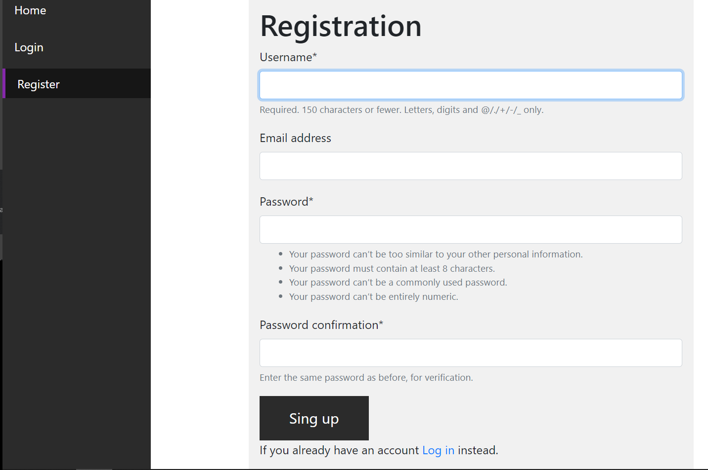
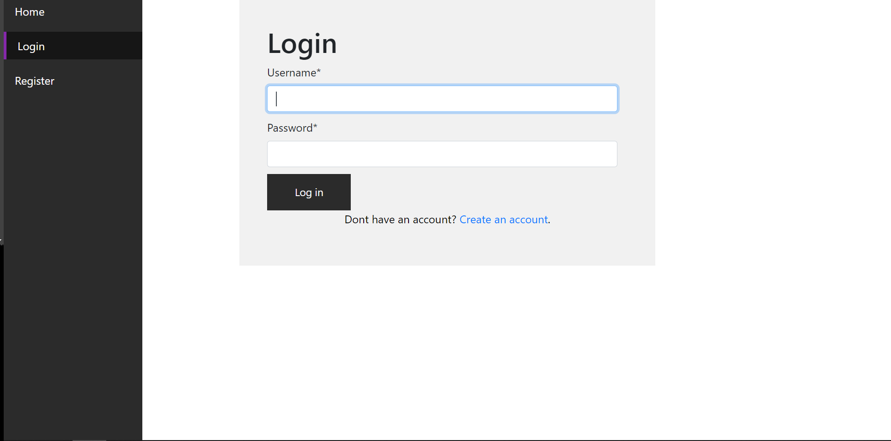

### Notification

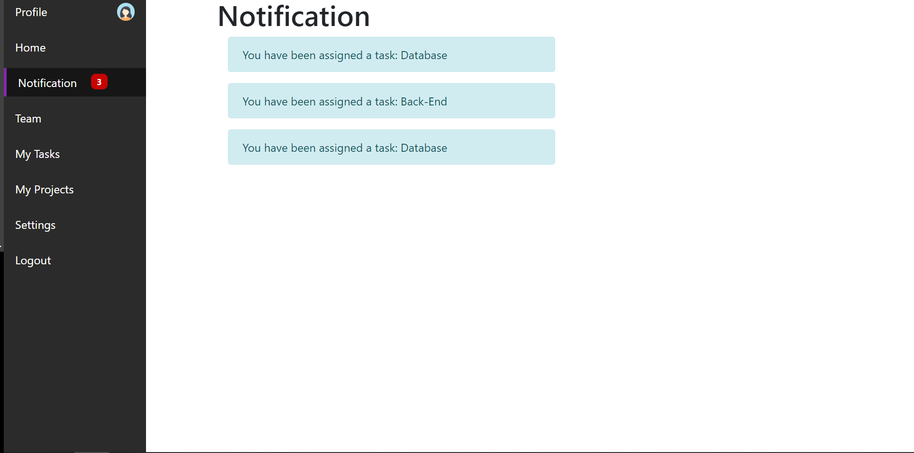

We get a notification when we are invited to join a team, when we are assigned to a task

- Task deadline reminder notifications coming soon

### Settings
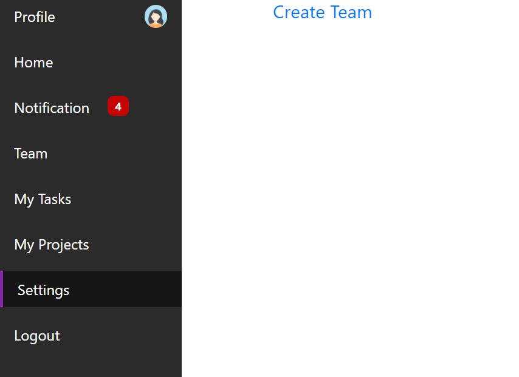

In setting we have a link to create team

### Team Members

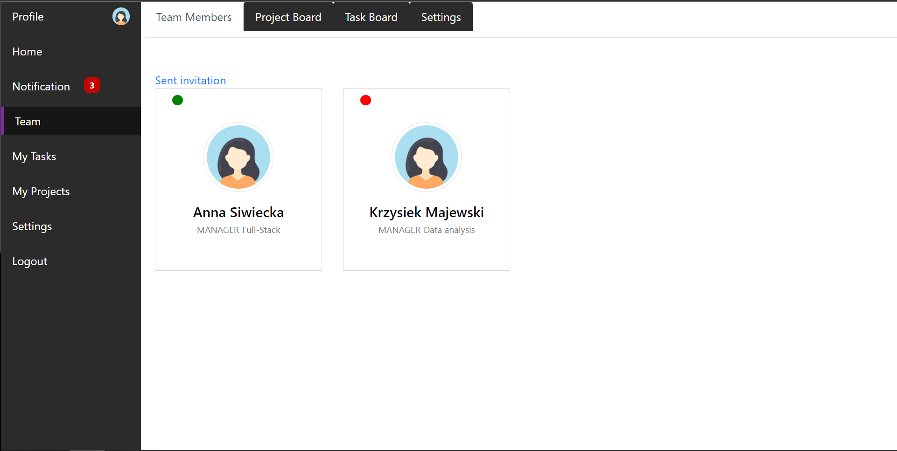
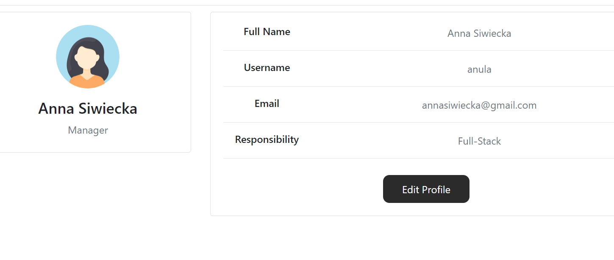

We can see our team, we can see if a team member is active and there is also the possibility to see the person's team profile, by sharing emails we can keep in touch. You can also see the responsibilities, the owner can edit team profiles and also give the manager to someone

### Projects

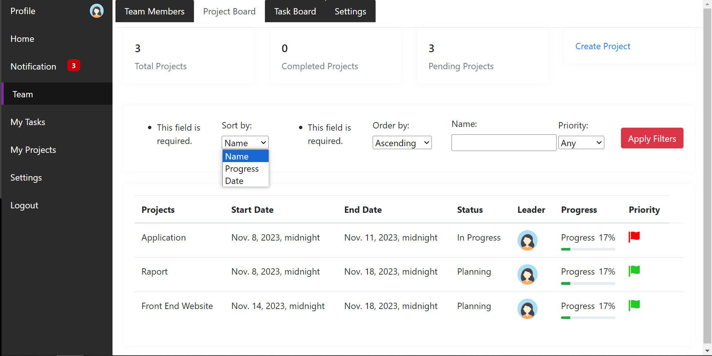
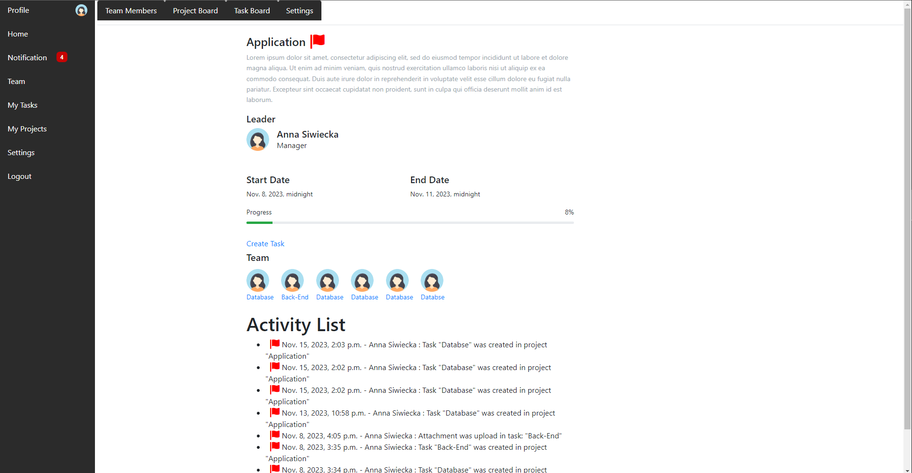

On the project board we can see all projects, the progress of the project leader as well as the project priority, at the top of the page we can see the number of all projects, completed projects as well as projects in progress. 
Owner can create projects and appoint leaders.

On the project page, there is a title, a description of the project. The leader can create tasks and assign them to team members. There is also an Activity sector, where you can see the activity of team members.

Sorting (asc desc) by date, name-alphabetical, progress, search by name and by priority is available.

When every tasks are completed and progress = 100% status of project change to "Completed"

- improved image of the activity sector, and more features in the activity sector coming soon

### My Projects

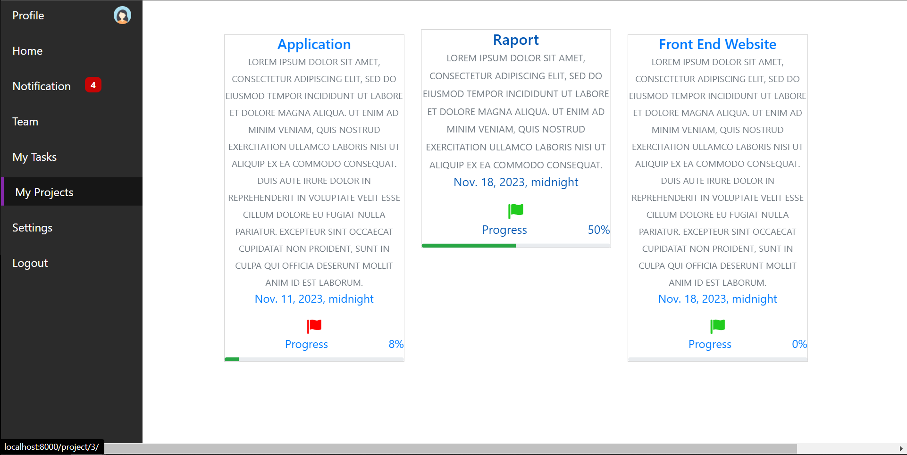

On the my_project page, we have a shortcut to the project and a link that takes us to the project page,
It is a visible project when the user is a leader or is assigned to a task in a specific project.

### Tasks

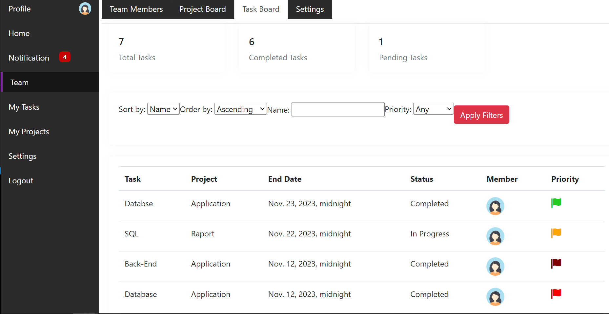
.png)

On the task board it is possible to see who is assigned to a task, what the progress is, what the priority is and also which project the task belongs to.
At the top of the page we can see the number of all tasks, completed tasks as well as tasks in progress.
Sorting (asc desc) by date, name-alphabetical, progress, search by name and by priority is available.

On the task page the user can add attachments, there is also a comments section where the leader can comment on the user's work

When everything is okay with attachments and solution in task, leader can change status of task to "Completed"

- Better view of the tasks page coming soon 

### My Tasks
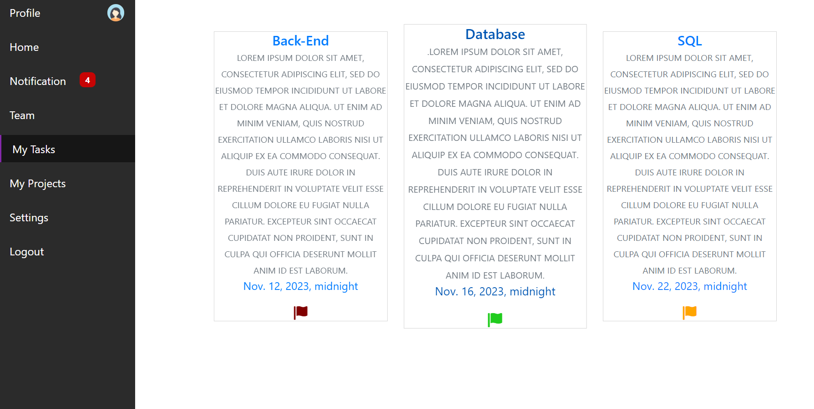

On the my_tasks page, we have a shortcut to the task and a link that takes us to the task page.

### Other

- Setting page for team, home page with all shortcuts and reminders, my_project page with shortcuts, team home page coming soon.

## License

This project is licensed under the [MIT License](LICENSE).