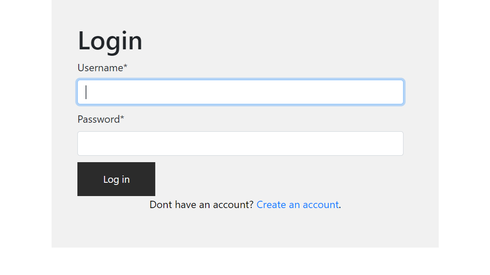
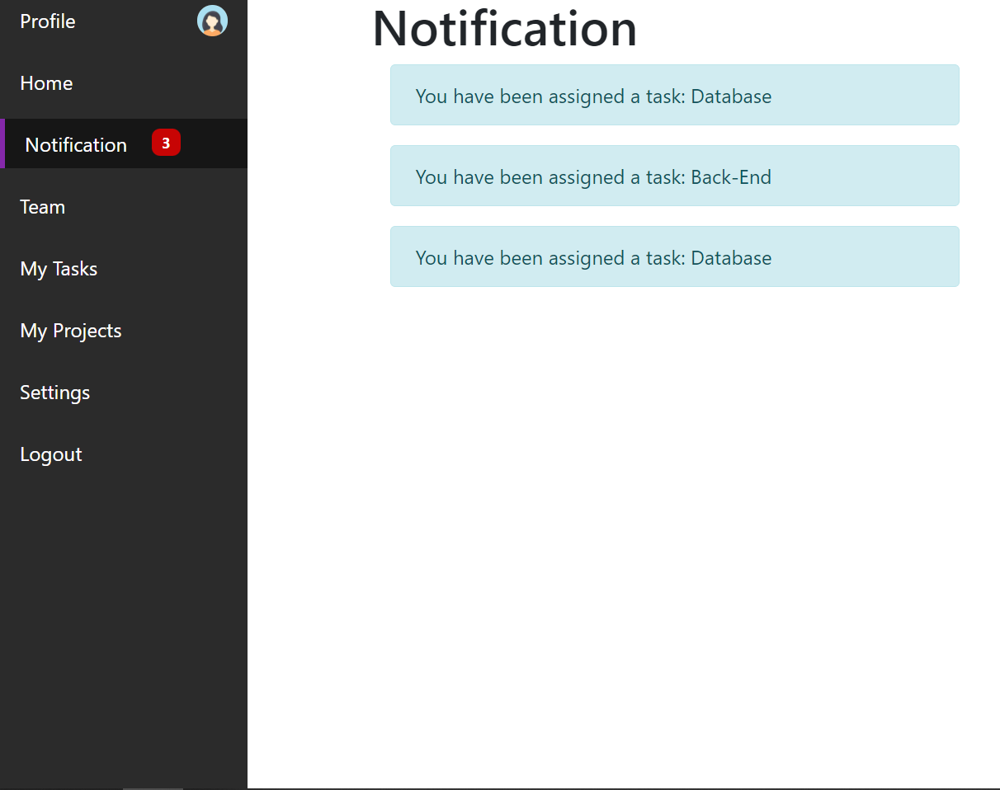
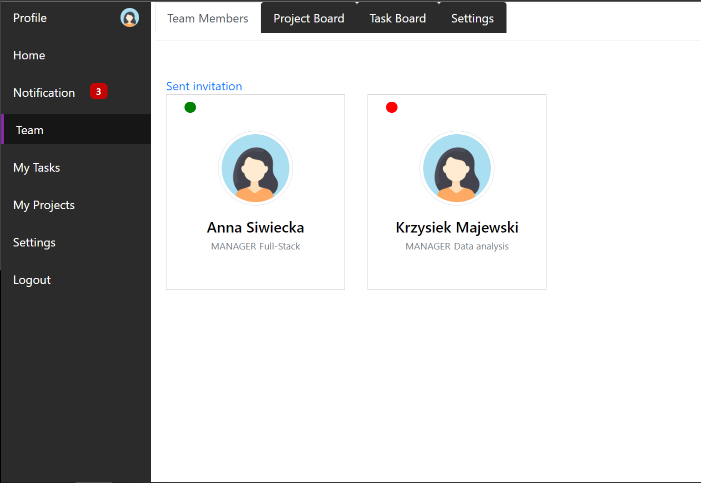
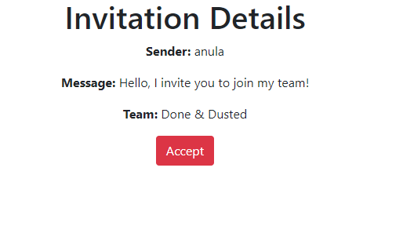
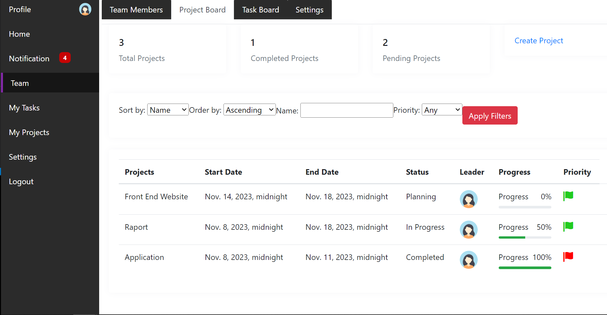
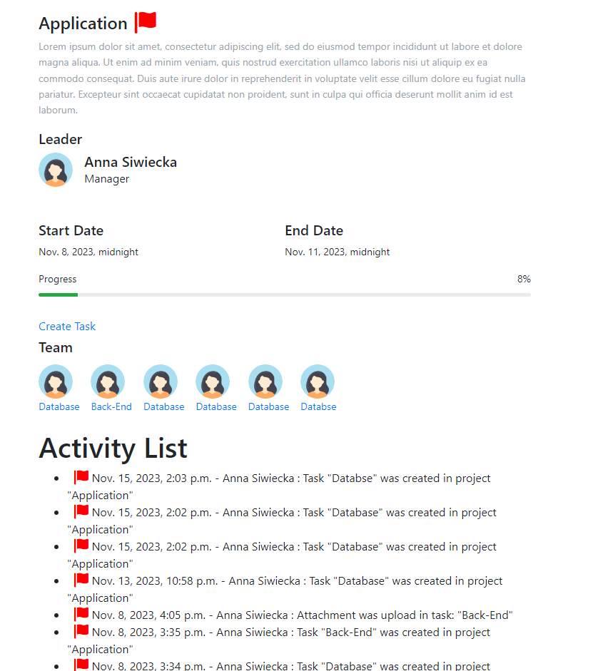
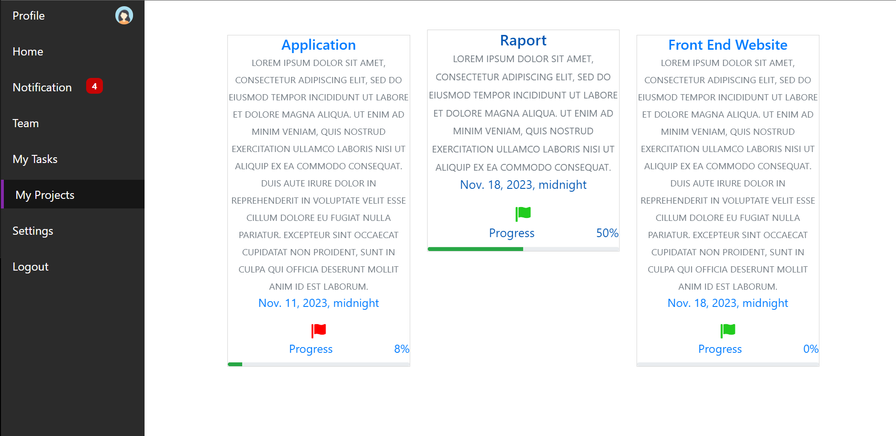

# Web Task Management: Collaborative Project Management for Remote Teams

The project curently is coming to an end and also the current code is being improved on an ongoing basis.

I created a web-based platform: a system that manages tasks in remote teams, facilitating effective collaboration on projects. Real-time task assignment, priority tracking and role-based access control were implemented. The platform allows the Owner to oversee every element in the team, designates leaders to manage projects. Project leaders oversee the team's progress. There is also constant communication thanks to shared emails. The process of deploying team members is based on invitations.

## Installation

1. First, clone the repository.
2. Next, run 

```python
On windows:
    'python manage.py runserver'

On macOS or Linux:
    'python3 manage.py runserver'
```

## Technologies

- **Python**: Main programming language.
    -  Version 3.12

- **Django**: A web framework for Python applications.
    - Version: 4.2.6

- **PostgreSQL**: Relational database management system.
    - Version: 16

- **psycopg**: PostgreSQL database adapter for Python.
    - Version: 3.1.12

- **SQLparse**: Library for parsing and manipulating SQL queries in Python.
  - Version: 0.4.4

- **asgiref**: Library that supports handling asynchronous code in Django.
  - Version: 3.7.2

- **HTML5**: Markup language for structuring content.

- **CSS**: Style sheets for styling the user interface.

- **JavaScript**: Used for dynamic page functions.

- **jQuery**: A JavaScript library for facilitating HTML document manipulation.
  - Version: 3.6.0

- **crispy-bootstrap4**: Bootstrap 4 integration with Django Crispy Forms.
    - Version: 2023.1

- **Pillow**: Python image handling library.
    - Version: 10.1.0


# Project

## Content
1. [Registration, Login](#registration-Login)
2. [Notification](#Notification)
3. [Settings](#Settings)
4. [Create Team](#Create-Team)
5. [Team](#Team)
6. [Team-Settings](#Team-Settings)
7. [Team Members](#Team-Members)
8. [Projects](#Projects)
9. [Tasks](#Tasks)
10. [Other](#Other)

### Registration, Login




### Notification


You can get a notification when: 
 - You get an invitation to join the team,
- You have been assigned to a task

### Settings


On setting page we have a link to create team

### Create Team 


To create a team, enter the name and description of the team

### Team


The team's head page shows the name, description and owner of the team

### Team Settings


On the team settings page for the owner there is an option to delete the team, and for a regular member there is an option to leave the team

### Team Members



In the list of team members, we can see whether a member is an owner manager or a regular member, and we can also see who is currently active. 


The owner can send an invitation to the team, you need to find an existing user and send an invitation. There is a broadcast message from the top, but it can be modified. 



To accept the invitation, simply click accept, and then you will be redirected to the team's page


On the team member's profile page, you can see what responsibilities a person has, and the member's email is visible, so you can keep in touch.
The owner can edit the profiles of team members: duties, and can give or take away manager functions.

### Projects



The project board shows all projects, there is a limit of 10 projects per page. The name, leader, status, progress and priority of the project are visible. There is Ascending and Descending sorting by date, progress and project name. You can search for a project by name, and also search for a project with a specific priority.


The owner can create a project. Enter the name, description, start date and end date, select the project leader and priority. The default project status is "In planning"



On the project page is the name, description, name of the leader, tasks and profile picture of the person who is assigned to a specific task. Leader can assign tasks to team members. 
There is an activity list, documented activity is by assigning a task, attaching attachments and the task and finishing the task. 
After finishing all tasks, tasks whose status is "completed" project progress is 100% automatically project status is changed to "completed"



On the "My Projects" page there are shortcuts and links to the projects to which we belong, The project in which we are a leader or are assigned to a task in a particular project, it will be on the My Project page

### Tasks


The task board shows the name of the task, the name of the project to which the task is assigned, the end date of the task, the status, the team member to which the task is assigned, and the priority.
It is possible to sort tasks Ascending and Descending by date and name. You can also search for a task by name and also by task priority. At the top of the page you can see the number of all tasks, finished tasks and tasks that are in progress. 
 


To create a task, you need to enter a name, task description. Assign a person to the task, set the end date of the task (the initial one defaults to the start date of the project) and the priority of the task. The default status of the task is "Not Started".
With the first task created, the project status changes to "In Progress"


On the task page you can see what project the task is assigned to, you can see the user who is assigned to the task, the name , description, status, end date of the task. There is an attachments sector, where the leader or team member assigned to the task can attach attachments. An attachment can also be attached with description. There is a comments sector, comments can be written by the leader and the team member assigned to the team. After the first uploaded attachment, the status of the task changes to "In Progress" Comments and attachments already uploaded are visible to all team members. The project leader, after reviewing all sent attachments and accepting them, can change the status of the task to "Completed"


On the "My Tasks" page there are shortcuts and links to the tasks we are assign to. 

### Other

Project and task end date notifications, user home page with shortcuts, better sorting view coming soon

## License

This project is licensed under the [MIT License](LICENSE).